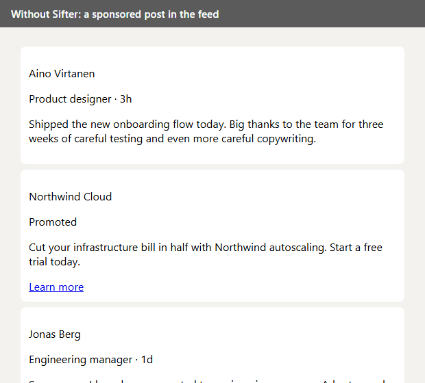
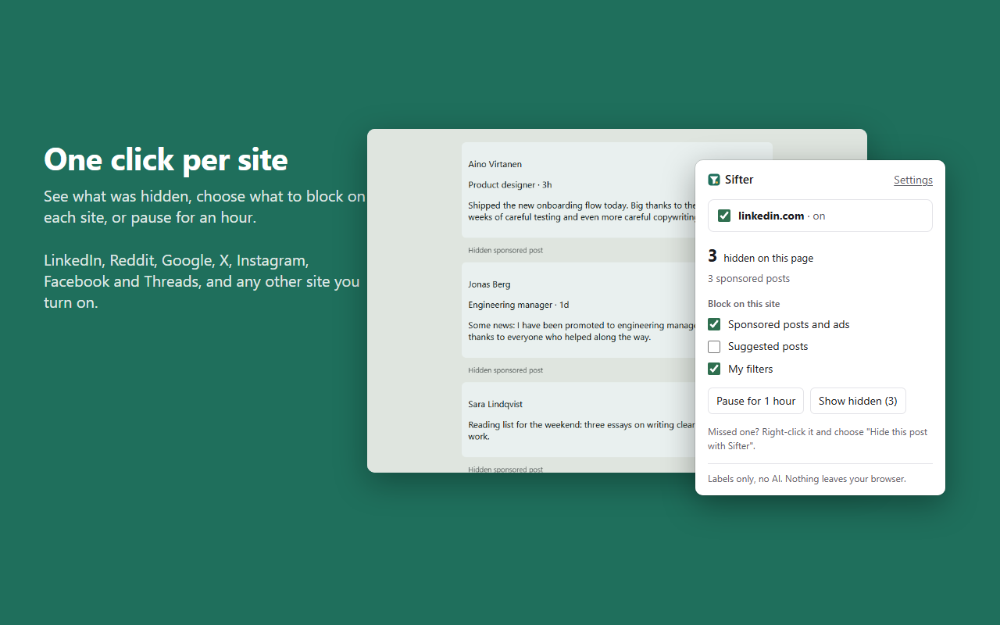
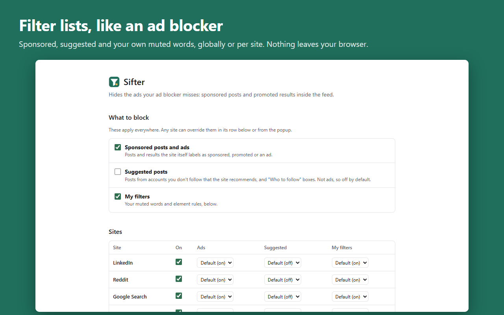

<p align="center">
  
</p>

<h1 align="center">Sifter</h1>

<p align="center">
  A Chrome extension that hides the ads your ad blocker misses:<br>
  sponsored posts and promoted results inside the feed.
</p>

<p align="center">
  <a href="https://github.com/danieljpuusitalo/sifter/actions/workflows/ci.yml"></a>
  <a href="LICENSE"></a>
  
  
</p>

<p align="center">
  
</p>

The feed above is a synthetic fixture, not a real account: every screenshot and
test in this repo is rendered from `fixtures/public/`.

## Why this exists

Ad blockers work on the network: they stop requests to ad servers. Sponsored posts
on LinkedIn, Reddit, Instagram, Facebook, X and Threads, and the ads at the top of
Google results, are served by the site itself, in the same response as everything
else. There is nothing to block. So they get through.

Sifter works on the page instead. Every one of those units carries a label the site
has to show ("Sponsored", "Promoted", "Ad"). Sifter finds the label and hides the
post it belongs to.

## How it works

1. **Read the label.** A small JSON adapter per site says where posts are and where
   their labels sit. Sifter checks the label text the way you would see it, so a
   decoy hidden span does not fool it.
2. **Collapse the post.** The post stays in the page, hidden behind a one-line
   placeholder. Nothing is deleted, so infinite scroll and the site's own scripts
   keep working.
3. **Let you undo it.** Every placeholder has **Show** and **Not an ad**. Sifter
   remembers "Not an ad" for that post.

It runs entirely in your browser. No account, no server, no AI, no analytics.
Precision comes first: when Sifter is not sure, it leaves the post alone.

## Install

**Chrome Web Store:** not yet listed. The link goes here once the store approves it.

**Manual install, until then:**

1. Download the zip from the [latest release](https://github.com/danieljpuusitalo/sifter/releases/latest).
2. Unzip it.
3. Open `chrome://extensions` and turn on **Developer mode** (top right).
4. Click **Load unpacked** and select the unzipped folder.

Works in Chrome 116 or newer and in other Chromium browsers such as Edge and Brave.

## What it covers

| Site | Sponsored posts | Suggested posts | Checked on the live site |
|---|---|---|---|
| LinkedIn | yes | yes | sponsored: yes · suggested: yes (English; NL/DE/FR unchecked) |
| Reddit | yes | – | works in use; markup not inspected against the adapter |
| Google Search | yes (text ads, shopping units) | – | yes (EN and NL), both shapes of the top "Sponsored products" carousel. Google rotates its markup by experiment, so a new shape is a one-line adapter fix. Maps and promoted places in the local pack: not covered |
| X | yes | "Who to follow" | yes |
| Instagram | yes | yes | sponsored: yes · suggested: yes (English; NL/DE/FR unchecked) |
| Facebook | yes | yes | feed and right-rail ads: yes · suggested: yes (English) |
| Threads | yes | – | runs without hiding organic posts; no ad has shown up yet to confirm the ad path |

"Not yet" means the rules come from known markup and pass the synthetic fixtures,
but nobody has watched them work on a logged-in feed. Each adapter's `verified`
field in `src/adapters/` records exactly what was checked and when.

**Any other site** can be turned on from the popup ("Hide ads on this site"). There
Sifter uses general detection: it hides elements whose whole visible label is
"Sponsored", "Ad" or similar.

## What you control

<table>
  <tr>
    <td width="50%"></td>
    <td width="50%"></td>
  </tr>
  <tr>
    <td>The popup: what is hidden on this page, per-category switches, per-site overrides, pause.</td>
    <td>Settings: muted words, element rules, per-site suggested-post switches, backup and restore.</td>
  </tr>
</table>

- **What to block**, like an ad blocker's filter lists: sponsored posts (on by
  default), suggested posts from accounts you don't follow (off by default, since
  they aren't ads) and your own filters. Set these globally, then override per site.
- **Muted words.** Hide any post containing a word or phrase.
- **Element rules** in the ad-blocker form `site##selector`.
- **Hide this post**, from the right-click menu, for anything Sifter missed.
- **Not an ad / Always show** on any hidden post. Sifter remembers these.
- **How hidden posts look:** collapsed to a one-line note, blurred, or removed from
  view. Sifter never deletes anything from the page; every hide can be undone.
- **Pause for an hour**, turn any site off, and back up or restore everything as one file.

## Privacy

Sifter collects nothing and sends nothing. It has no server, no account, no
analytics and makes no network requests of its own. Settings and the fingerprints
of posts you marked stay in your browser's extension storage. The full policy is
[PRIVACY.md](PRIVACY.md), also published at
[danieljpuusitalo.github.io/sifter/privacy](https://danieljpuusitalo.github.io/sifter/privacy/).

## A site stopped working?

Sites change their markup. When that happens the fix is usually one selector in
that site's adapter (`src/adapters/<site>.json`) plus a fixture case that shows the
change. [Open an issue](https://github.com/danieljpuusitalo/sifter/issues/new) with
the site, what you expected to be hidden, and whether the post shows a visible
"Sponsored" or "Promoted" label.

## Development

Requires Node 24 and pnpm.

```sh
pnpm install
pnpm exec playwright install chromium   # first time only
pnpm dev          # Chromium with the extension loaded, hot reload
pnpm verify       # typecheck + unit tests + fixture eval (what CI runs)
pnpm test:e2e     # the built extension against local fixtures
pnpm build        # .output/chrome-mv3 and a store zip
```

Tests never touch a live site. Each adapter is checked against a synthetic fixture
in `fixtures/public/` that marks every post with the right answer (`data-gold`), and
`pnpm eval:mock` fails on any wrongly hidden post or missed ad. CI runs typecheck,
unit tests, the fixture eval, a production build and the Playwright end-to-end suite
on every push. A `v*` tag builds the release zip and publishes a GitHub Release.

`CLAUDE.md` has the working rules, `BRIEF.md` the original spec, `CHECKPOINT.md`
the current state, `docs/ROADMAP.md` the path to the store and `docs/VISION.md` the
longer-term architecture.

## Changelog and licence

Changes are in [CHANGELOG.md](CHANGELOG.md). MIT licence, see [LICENSE](LICENSE).
